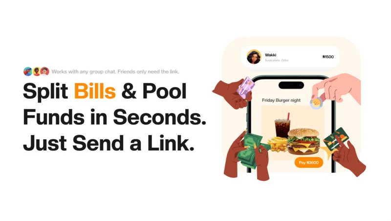

# Chop

**Chop** is a group payment splitting app built for Nigerian users. Create a session, share a link, and everyone pays their share — no app download required.

---

## What it does

There are three ways to split with Chop:

**Chop Food** — Order food as a group. The organizer builds a menu, assigns each item to a person (or splits it equally), and shares a payment link. Each participant pays exactly what they ordered.

**Chop Bill** — Split any bill by equal share, custom naira amount, or percentage. Ideal for utility bills, restaurant tabs, or group subscriptions.

**Chop In** — Pool money toward a goal. Great for gifts, trips, or events. Participants contribute any amount they choose, and the organizer withdraws when they're ready.

---

## How it works

1. **Sign up** with your Google account or email and password.
2. **Create a session** — pick a mode, name it, add participants and amounts.
3. **Share the link** — send the generated link (or QR code) to your group via WhatsApp or any channel.
4. **Everyone pays** — participants open the link in any browser, pick their payment method, and pay through Bachs (debit card or bank transfer).
5. **Get paid** — once all participants have settled, the organizer finalises the session and withdraws funds directly to their bank account.

---

## Payments

Payments are processed by **Bachs**, a Nigerian payment platform. All transactions are in Nigerian Naira (₦). No money is ever stored by Chop — funds are held by Bachs and paid out to the organizer's bank on request.

---

## Privacy & security

- Participants only need a browser — no account required to pay.
- Organizer accounts are secured with Google OAuth or email/password with OTP verification.
- All payment processing is handled by Bachs; card and account details never touch Chop's servers.
